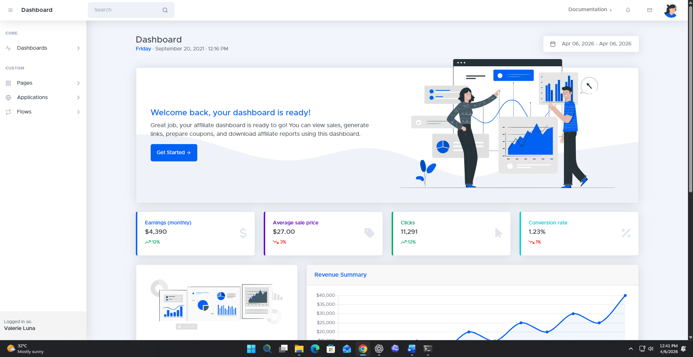

# SB Admin 2 React



A React + Vite project that adapts the SB Admin Pro template into a cleaner JSX-based structure.

This project focuses on:

- converting template screens into React pages under `src/pages`
- keeping shared layout parts reusable through `src/component`
- using React Router for page navigation
- preserving the original SB Admin visual style while making the code easier to read and extend

## Tech Stack

- React
- Vite
- React Router
- Bootstrap 5
- Feather Icons
- Chart.js
- Litepicker
- Simple-DataTables

## Project Structure

```text
src/
  assets/        Images, fonts, and template assets
  component/     Reusable layout and UI components
  css/           Template styles
  hooks/         Shared React hooks
  js/            Template helper scripts
  pages/         Route-based page components grouped by feature
  routes/        Explicit React Router route definitions
  App.jsx        Main app shell
  main.jsx       App entry point
```

## Available Routes

Current pages include:

- `/dashboard`
- `/default-dashboard`
- `/account-profile`
- `/account-billing`
- `/account-security`
- `/account-notifications`
- `/auth-login-basic`
- `/auth-register-basic`
- `/auth-password-basic`
- `/auth-login-social`
- `/auth-register-social`
- `/auth-password-social`
- `/auth-redirect`
- `/error-400`
- `/error-401`
- `/error-403`
- `/error-404-1`
- `/error-404-2`
- `/error-500`
- `/error-503`
- `/error-504`
- `/pricing`
- `/invoice`
- `/knowledge-base-home-1`
- `/knowledge-base-home-2`
- `/knowledge-base-category`
- `/knowledge-base-article`
- `/user-management-list`
- `/user-management-edit-user`
- `/user-management-add-user`
- `/user-management-groups-list`
- `/user-management-org-details`
- `/blog-management-posts-list`
- `/blog-management-create-post`
- `/blog-management-edit-post`
- `/blog-management-posts-admin`
- `/multi-tenant-select`
- `/multi-tenant-join`
- `/multi-tenant-create`
- `/multi-tenant-add-users`
- `/wizard`

## Getting Started

Install dependencies:

```bash
npm install
```

Start the development server:

```bash
npm run dev
```

Create a production build:

```bash
npm run build
```

Preview the production build:

```bash
npm run preview
```

## Development Notes

- Shared navigation and layout live in `src/component`
- Vendor bootstrapping lives in `src/hooks/useTemplateVendors.js`
- Routes are intentionally kept explicit in `src/routes/AppRoutes.jsx` for readability
- Template pages should be added as JSX components in `src/pages`
- Internal navigation should use React Router components like `Link` and `NavLink`
- Interactive template features such as charts, icons, date pickers, and datatables are initialized from React page components

## Current Status

This project is an ongoing JSX-based conversion of the SB Admin template.

Some pages already follow the template closely, while others are still simplified React implementations and may need additional polishing to fully match the original design and behavior.

## License

This repository contains work based on the SB Admin Pro template. Please make sure your usage complies with the original template license.
